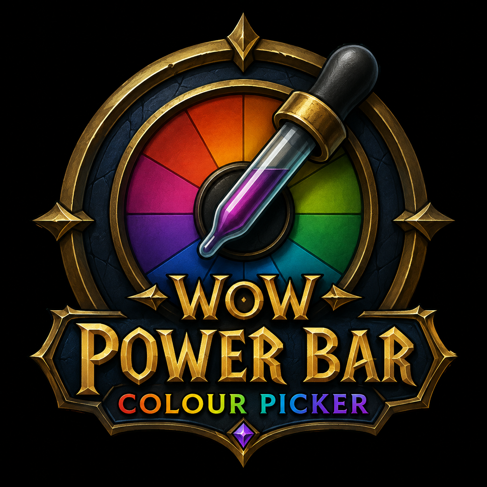

  

🎨 **Power Bar Colour Picker** is a lightweight World of Warcraft add-on that lets you customise the colours of your character's power bars, making them easier to see and allowing you to tailor them to your personal preference.

> **Currently built for World of Warcraft Classic Anniversary.**

## 💡 Why was it created?

I originally created the add-on because I struggled to clearly see my Mage's blue Mana bar while playing with Night Mode enabled on my laptop. Rather than changing my display settings every time I played, I wanted a simple way to make the Mana bar brighter and easier to see.

The add-on grew from that simple idea and now supports multiple power types:

* **Mana**
* **Rage**
* **Energy**
* **Focus**
* **Runic Power**

## ✨ Features

* 🎨 Easily change the colour of supported power bars.
* 🌈 Simple in-game colour picker.
* 🖌️ Set a different colour for each supported power type.
* 🔄 Reset individual colours back to their default.
* 💾 Your chosen colours are automatically saved between sessions.
* ⚡ Lightweight and designed to do one job without unnecessary extras.
* 🏰 Built for **WoW Classic Anniversary**.

## 📦 Installation

### CurseForge — Recommended

**Power Bar Colour Picker is intended to be installed and kept up to date through CurseForge.**

Simply install the add-on through the CurseForge app and it will be placed in the correct World of Warcraft folder automatically.

### Manual Installation

You can also install the add-on manually.

Download the add-on and place the **PowerBarColourPicker** folder inside your WoW Classic Anniversary `Interface\AddOns` directory.

The default Windows installation path is typically:

`World of Warcraft\_anniversary_\Interface\AddOns\PowerBarColourPicker`

Make sure the actual add-on files are directly inside the `PowerBarColourPicker` folder rather than inside an additional nested folder.

After installing, start or restart World of Warcraft and make sure **Power Bar Colour Picker** is enabled in the **AddOns** menu on the character selection screen.

## ⚙️ How to Use

Type:

`/pbcp`

This opens the **Power Bar Colour Picker** menu.

Simply select the power type you want to customise, choose your preferred colour, then close the window when you're finished.

Your colour choices are saved automatically and will persist when you log out, close the game or switch characters.

---

### 🎮 Quick Start

**1.** Install through CurseForge or manually place the add-on in your `Interface\AddOns` folder.  
**2.** Launch WoW Classic Anniversary.  
**3.** Type `/pbcp`.  
**4.** Select your power type.  
**5.** Pick your colour.  
**6.** Close the window — you're done! 🎨  
